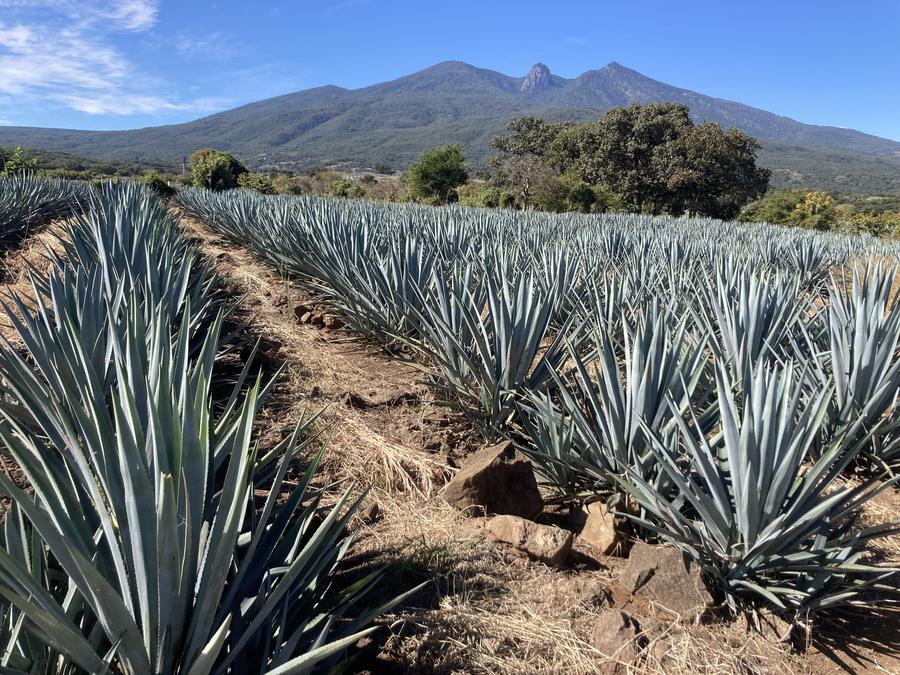

# Manual de edición — Linaje 59

Todo lo que necesitas para cambiar textos, fotos y datos del sitio. No necesitas saber programar.

---

## Regla de oro

Solo hay **un archivo** que vas a tocar para cambiar palabras y datos:

```
assets\js\content.js
```

Ábrelo con el **Bloc de notas**, con **VS Code**, o con cualquier editor de texto. **No lo abras con Word.**

Para cambiar fotos ni siquiera abres archivos: solo reemplazas imágenes en `assets\img\`.

---

## Cómo ver los cambios

1. Guarda el archivo que editaste (`Ctrl + S`)
2. Abre `index.html` con doble clic
3. En el navegador presiona **`Ctrl + F5`** — esto recarga ignorando la memoria caché

> Si guardaste y no ves el cambio, casi siempre es que faltó el `Ctrl + F5`.

---

## 1. Cambiar el nombre de la marca

Al principio de `content.js` está el bloque `BRAND`:

```js
const BRAND = {
  name: "LINAJE 59",
  heroWord: "LINAJE",
  heroNum: "59",
  founded: "1959",
```

| Campo | Dónde aparece |
|---|---|
| `name` | Menú de arriba, pie de página, título de la pestaña |
| `heroWord` | La palabra grande de la portada |
| `heroNum` | El número dorado gigante debajo |
| `founded` | El año, para referencia |

**Ejemplo.** Si mañana la marca se llama *Casa Ibarra*:

```js
  name: "CASA IBARRA",
  heroWord: "CASA IBARRA",
  heroNum: "",
```

Dejar `heroNum` vacío hace que el número desaparezca de la portada. No se rompe nada.

---

## 2. Cambiar contacto y datos legales

Justo abajo, en el mismo bloque `BRAND`:

```js
  email: "hola@linaje59.mx",
  phone: "+52 33 0000 0000",
  whatsapp: "523300000000",
  nom: "NOM-0000-CRT",
  crt: "CRT-0000",
```

**Cuidado con `whatsapp`:** va sin `+`, sin espacios y sin guiones. México lleva `52` al inicio.
Correcto: `523312345678` · Incorrecto: `+52 33 1234 5678`

Los campos `nom` y `crt` te los da tu maquiladora. Salen en el pie de página.

---

## 3. Cambiar cualquier texto del sitio

Después de `BRAND` viene el bloque `I18N`, dividido en dos: `es:` (español) y `en:` (inglés).

Cada frase tiene una **etiqueta** a la izquierda y el **texto** a la derecha entre comillas:

```js
"hero.tagline": "La misma tierra desde 1959.",
```

**Solo cambias lo que está entre las comillas de la derecha.**

✅ Correcto:
```js
"hero.tagline": "Tres generaciones, una sola tierra.",
```

❌ Incorrecto — no toques la etiqueta:
```js
"mi.frase": "Tres generaciones, una sola tierra.",
```

### Qué etiqueta corresponde a qué

| Empieza con | Es la sección |
|---|---|
| `gate.` | La pregunta de edad al entrar |
| `nav.` | El menú de arriba |
| `hero.` | La portada |
| `land.` | "El origen" |
| `est.` | "El predio" (el mosaico de fotos) |
| `proc.` | "El proceso" |
| `bot.` | "La botella" |
| `house.` | "La casa" |
| `cta.` | "Contacto" |
| `foot.` | Pie de página |
| `legal.` | Leyendas obligatorias |

### Muy importante: cambia las dos versiones

Cada frase existe **dos veces** — una en `es:` y otra en `en:`. Si solo cambias la española, el sitio en inglés queda con el texto viejo.

Busca la misma etiqueta más abajo, dentro del bloque `en:`, y cámbiala también.

---

## 4. Cambiar los nueve compromisos

Están en la lista `commitments`, más abajo:

```js
commitments: [
  ["100% agave",   "Sin mixtos, sin excepción."],
  ["Cero aditivos", "La norma permite 1% de abocantes..."],
```

Cada renglón es: `["Título corto", "Explicación"],`

- **Para cambiar uno:** edita el texto entre comillas
- **Para agregar uno:** copia un renglón completo, pégalo debajo y edítalo
- **Para quitar uno:** borra el renglón completo

La numeración (01, 02, 03…) se recalcula sola. No la escribas tú.

> Cada renglón termina en **coma**, menos el último. Si agregas uno al final, ponle coma al que estaba antes.

---

## 5. Cambiar la ficha técnica

Igual, en la lista `tech`:

```js
tech: [
  ["Categoría",  "100% de agave"],
  ["Clase",      "Blanco"],
  ["Graduación", "38% Alc. Vol."],
```

Mismo formato: `["Etiqueta", "Valor"],`

---

## 6. Cambiar fotos

**Aquí no editas código.** Solo reemplazas archivos en `assets\img\`.

### Las que ya están puestas

| Archivo | Dónde sale | Formato ideal |
|---|---|---|
| `hero.jpg` | Portada, pantalla completa | Horizontal, 2000 px de ancho |
| `tierra.jpg` | Sección "El origen" | Vertical, 1200 px |
| `botella.jpg` | Sección "La botella" | Vertical, 1200 px |
| `fundador.jpg` | Sección "La casa" (redonda) | Cuadrada, 900 px |
| `og.jpg` | Vista previa al compartir el link | 1200 × 630 px exacto |
| `predio\volcan.jpg` | Mosaico | Horizontal, 900 px |
| `predio\surcos.jpg` | Mosaico | Vertical, 900 px |
| `predio\caballo.jpg` | Mosaico | Vertical, 900 px |
| `predio\camino.jpg` | Mosaico | Horizontal, 900 px |
| `predio\mesa.jpg` | Mosaico | Horizontal, 900 px |
| `predio\ladera.jpg` | Mosaico | Horizontal, 900 px |

### Para cambiar una

1. Prepara tu foto nueva
2. Ponle **exactamente el mismo nombre** que la que vas a reemplazar
3. Cópiala a `assets\img\` y acepta reemplazar
4. `Ctrl + F5` en el navegador

Eso es todo. No se toca nada más.

### ⚠️ Falta la foto de botella

`botella.jpg` **no existe todavía** en este sitio. Mientras tanto se ve un recuadro con textura y una nota. En cuanto pongas el archivo, el recuadro desaparece solo.

### Antes de subir cualquier foto

**Comprímela.** Entra a [squoosh.app](https://squoosh.app), arrastra la foto, baja la calidad a 80 y descarga. Máximo **600 KB** por imagen.

Una foto de 6 MB hace que el sitio tarde en cargar, y un comprador de hotel no espera.

**Quítale la ubicación.** Las fotos del celular traen las coordenadas GPS de donde las tomaste. Publicarlas expone dónde están tus parcelas. En Windows: clic derecho en la foto → Propiedades → Detalles → **"Quitar propiedades e información personal"**.

---

## 7. Cambiar el orden o tamaño del mosaico

Esto sí es en `index.html`, entre las líneas 94 y 100:

```html
<figure class="w2"><img src="assets/img/predio/surcos.jpg" ...
```

- `w2` = ocupa **2 columnas de ancho** → para fotos horizontales
- `h2` = ocupa **2 filas de alto** → para fotos verticales

Si cambias una foto horizontal por una vertical, cámbiale también la clase de `w2` a `h2`.

Para reordenar, mueve los renglones completos de lugar.

---

## 8. Errores comunes

| Se ve así | Qué pasó |
|---|---|
| Página en blanco | Falta una coma o una comilla en `content.js` |
| Sale el texto de antes | Faltó `Ctrl + F5` |
| Un texto aparece vacío | Borraste la etiqueta en vez del texto |
| Sale en inglés lo que cambiaste en español | No cambiaste la versión del bloque `en:` |
| Foto no aparece | El nombre del archivo no coincide, o le pusiste `.jpeg` en vez de `.jpg` |
| Aparece un recuadro con textura | No existe esa foto todavía. Es normal, no es un error |

### Si dejaste la página en blanco

Se te pasó una coma. Para encontrarla:

1. En el navegador presiona **`F12`**
2. Pestaña **Console**
3. El error rojo te dice el número de línea

**Regla:** cada renglón lleva coma al final, **menos el último** de cada bloque.

---

## 9. Respaldo

Antes de hacer cambios grandes, copia la carpeta `Linaje59` completa y pégala como `Linaje59-respaldo`. Si algo se rompe, borras y restauras.

Si algún día lo subes a GitHub, ese es tu respaldo real y ya no necesitas copias.

---

## 10. Publicarlo en internet

Está listo para GitHub Pages o Vercel — sin build, sin instalar nada.

### GitHub Pages

```bash
cd "C:\Users\dario\OneDrive\Desktop\EMPRESA_TEQUILERA\Linaje59"
git init
git add .
git commit -m "Sitio Linaje 59"
git branch -M main
git remote add origin https://github.com/darioibarra05/NOMBRE-DEL-REPO.git
git push -u origin main
```

Luego en GitHub: **Settings → Pages → Source: `main` / root → Save.**

### Vercel

Arrastra la carpeta a [vercel.com/new](https://vercel.com/new). Listo.

---

## Antes de mandarle el link a un comprador

- [ ] Correo, teléfono y WhatsApp reales en `BRAND`
- [ ] NOM y CRT reales
- [ ] Subir `botella.jpg`
- [ ] Revisar que la ficha técnica coincida con lo que de verdad produjiste
- [ ] Abrirlo en el celular — la mitad lo van a ver ahí
- [ ] Probar el botón de WhatsApp
- [ ] Cambiar al inglés y revisar que todo esté traducido

---

## Dos notas sobre el contenido

**El año 1959.** Todo el sitio está escrito alrededor de que 1959 es el año en que tu abuelo sembró la primera parcela. Si la fecha real es otra, cámbiala en `founded`, en `land.s1d` y en los textos `hero.tagline`, `land.lead` y `land.body` — en español y en inglés. Si el número no corresponde a nada real, mejor cambia el nombre: un número inventado en una botella premium se nota.

**38% Alc. Vol.** Está así en la ficha técnica. Estados Unidos exige mínimo 40% para destilados, así que si algún día exportas hay que cambiar el dato y el producto.
